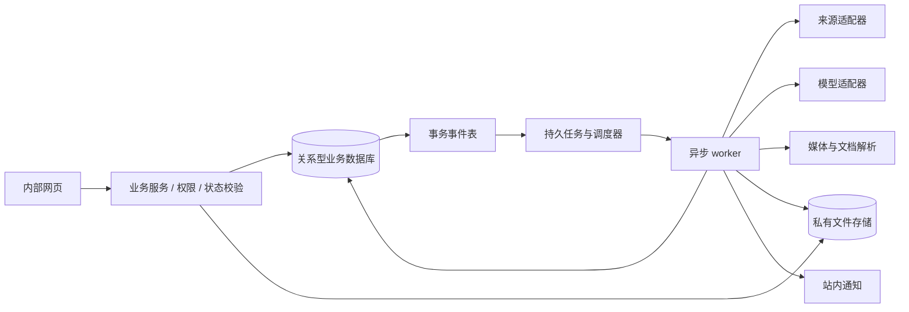

# 04 系统架构与非功能要求

v1.0｜2026-10-06。以下为实现建议，不锁定开发语言、框架或云供应商。版本选型由开发在开工评审记录，本文不包含可执行代码。

## 1. 首版结构

建议采用模块化单体业务服务＋独立异步 worker，不为“AI 运营”先拆多个微服务。需要独立运行的采集浏览器可作为隔离执行器。网页关闭后，采集与开奖提醒仍在服务端运行。

数据库保存业务状态、版本、来源、任务、通知和指标；对象存储保存源文件、预览、截图、证据与导出包。素材文件范围按[CHANGE-002 / ADR-004](../decisions/ADR-004-S2首版PNG素材范围.md)：普通素材仅PNG，品牌规范独立接受PDF；其他素材格式在下版实现。来源证据、后台导入等模块仍按各自规格处理，不能用通用对象存储能力绕过素材格式限制。搜索首版使用数据库索引＋标签，语义检索后加。任务队列可以是数据库驱动实现或独立队列，必须持久、可重试、可观察；不能只靠进程内定时器。

模块边界：身份权限、规范资产、来源采集、选题内容、排期活动、数据复盘、通知审计。模块之间通过稳定业务命令操作，禁止 AI 直接修改数据库或跨过状态守卫。

## 2. 长任务协议

采集、OCR、AI 生成、预览、打包、周报均异步：创建任务 → 返回 job_id → 页面显示状态 → 拉取结果或订阅状态。状态 queued/running/succeeded/partial/failed/cancelled。任务有请求者、输入版本、幂等键、尝试数、租约、心跳、错误原因与结果引用。

输入版本变化时，旧任务可保留结果供比较，但不得自动覆盖新草稿。取消与完成竞争时，以提交结果时的取消标记为准。模型超时和来源失败有独立配额，不拖住开奖 worker。采用至少一次执行，靠唯一键与事务确保业务结果不重复。

## 3. 数据与文件保护

工作区权限、下载权限在服务端检查；对象存储默认私有，通过短期签名下载地址访问。签名 URL 不进入公开日志。凭据只保存密钥引用，采集会话与业务日志隔离；不可让模型读账号密码或完整 cookie。

采集与用户链接读取只允许预配置来源域；校验重定向、协议和目标 IP，阻断内网、回环及云元数据地址，防止服务端代取任意内部资源。文件处理验证 MIME/真实格式，限制解压大小和路径，禁用宏与任意脚本执行。解析器隔离、限时限内存；大 3D 工程不直接交给模型。

外部文章、评论、PDF 内指令为数据；AI 工具权限不从文档内容变化。敏感账号数据送模型前按工作区设置裁剪，所有外部服务接入记录用途、保留约定与允许数据类型。

## 4. 建议质量目标

这些是用于估时和验收的建议默认，技术评审可调整并更新测试规模；不是未经容量验证的承诺。

| 项目 | 首版目标/测试条件 |
|---|---|
| 规模假设 | 1 个工作区、1 个账号、5 个并发内部用户，10,000 个素材元数据、10,000 条线索、1,000 篇内容 |
| 常规列表/详情 | 上述种子规模下接口 p95 ≤1秒，不含文件下载和第三方请求；前端主要内容可操作 ≤3秒（约定测试网络） |
| 异步提交 | ≤2秒返回 job_id；不等待模型完成才响应 |
| 提醒及时性 | 正常服务状态下到期站内通知 p95 延迟≤60秒；故障期间须记录迟到并恢复，不承诺外部渠道送达 |
| 刷新状态 | 前台每 5秒左右刷新运行状态或使用推送，离开页面停止无意义轮询 |
| 上传 | 大文件分片与失败恢复；默认单文件上限建议 2GB、并发 2 个，开工用真实素材验证后配置 |
| 可恢复性 | 建议数据库 RPO≤24小时、RTO≤4小时；对象存储启用版本/恢复策略，恢复演练实测 |
| 服务时间 | 工作日和周末均支持服务端提醒；维护窗口和无人值守报警责任人必须明确 |

首版默认任务并发：采集每源 1、媒体处理 2、AI 2、提醒独立小池；具体数值可配置。不要把大型视频处理排在开奖通知前。页面虚拟滚动/分页，禁止首屏下载全素材原文件。

## 5. 可观察性

每个请求带 request_id，异步任务传递 correlation_id，保留来源连接、批次、内容版本和事件版本。记录成功率、延迟、队列年龄、超时、重试、成本和权限拒绝；不记录完整凭据、签名链接或不必要的个人资料。

告警：提醒队列延迟超过目标、连续来源失效、解析失败突增、模型预算将耗尽、存储失败、备份失败。模型或来源故障降级为可编辑现有草稿；提醒和手动工作不能一起失效。

## 6. 部署与版本

开发/测试/生产的数据库、桶、凭据、任务命名空间完全隔离；测试不触发真实通知或外部写操作。测试数据显著标记 demo。数据库迁移先在备份副本演练，采用兼容性新增字段再切读写的方式；回滚应用不等于数据库可以无损降级。

保存模型名称与版本、提示词版本、解析器版本、数据源适配器版本，更新前运行固定回归集。业务规格、来源字段与提示词均应版本管理。
