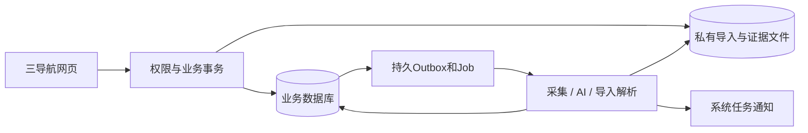

# 04 系统架构与非功能要求

v1.2｜2026-10-09。沿用现有 TypeScript/React/NestJS/PostgreSQL 模块化单体及独立 worker/scheduler，不重建工程。当前范围见[ADR-008](../decisions/ADR-008-删除排期日历与活动.md)。

## 1. 架构边界

保留身份账号、来源、选题、独立已发布笔记、数据复盘、反馈、通知审计。取消规范资产、内容生产及日历/活动模块；删除专用PNG缩略图/PDF手册分页/ZIP导出处理，导入截图显示/OCR和表格解析按独立目的实现。私有文件、安全解析和存储不是IP资产库功能，保留必要基础。

## 2. 异步与隔离

采集、选题/周报AI、OCR和表格解析异步返回job_id；任务有租约、心跳、幂等、输入版本、取消、重试和结果守卫。至少一次执行不重复业务效果。输入或权限改变时拒绝旧结果应用；模型建议不自动改已采纳决策。

网页关闭后来源定时采集、任务派发及上传过期清理仍持续；保持采集/AI/解析资源限制。活动提醒独立池和业务补偿取消，相关服务/配置/诊断退出。切换新范围须停止旧制作/预览/导出及排期/活动/回收消费者和创建入口，清理取消范围的未分发Outbox并保留终止记录，不整删scheduler或通用Outbox。

## 3. 数据与文件安全

工作区/账号/文件目的在服务端验证；对象存储私有，短期签名地址不写日志。凭据使用受限配置/引用，不送模型。采集域名、重定向、协议和目标IP校验，拒绝内网/回环/云元数据读取。

导入文件校验扩展名、MIME、真实格式和大小，图片解码及XLSX解压限额；禁宏/脚本，隔离解析资源。外部来源、表格/截图提取文字和反馈中的指令视为数据。删除素材处理器不能删除这些安全边界。

## 4. 质量目标与容量

| 项目 | 目标/条件 |
|---|---|
| 规模 | 一个工作区/账号、5并发用户、1万线索、1千已发布笔记、10万有效指标观察；不再压测资产/制作版本 |
| 常规API | 上述规模下列表/详情p95≤1秒，不含第三方/文件下载 |
| 前端/提交 | 主界面可操作≤3秒；异步受理≤2秒，记录网络/机器条件 |
| 导入文件 | 建议截图单件≤20MiB，CSV/XLSX≤50MiB，批次总量≤100MiB；S11-02/S7用真实样本冻结，非已验证兼容承诺 |
| 恢复 | 建议RPO≤24小时、RTO≤4小时；数据库与证据文件同恢复点演练 |

已有2GiB分片实现可复用协议，但不沿用品牌手册体积和格式作为新需求。并发沿用每来源1、AI2、导入解析受限独立资源；配置和容量实测后确认。分页稳定，首屏不下载全量原件。

## 5. 观察与交付

request_id/correlation_id连接来源批次、输入版本、笔记和导入批次。记录延迟、队列年龄、失败、用量、预算状态、权限拒绝和备份失败，不记录凭据或个人明细。AI/来源失败保留已有选题和笔记登记和手工导入能力。

开发/测试/使用实例数据库、桶、凭据隔离。沿用Compose和原生开发入口，按新处理器收口Dockerfile/Compose/CI，不能先移除导入所需存储。应用清退先兼容迁移再切读写，实际旧表/对象清理由引用审计和恢复演练决定；不编辑已应用迁移。模型/提示词/Schema/适配器升级须版本化并复跑固定集。
