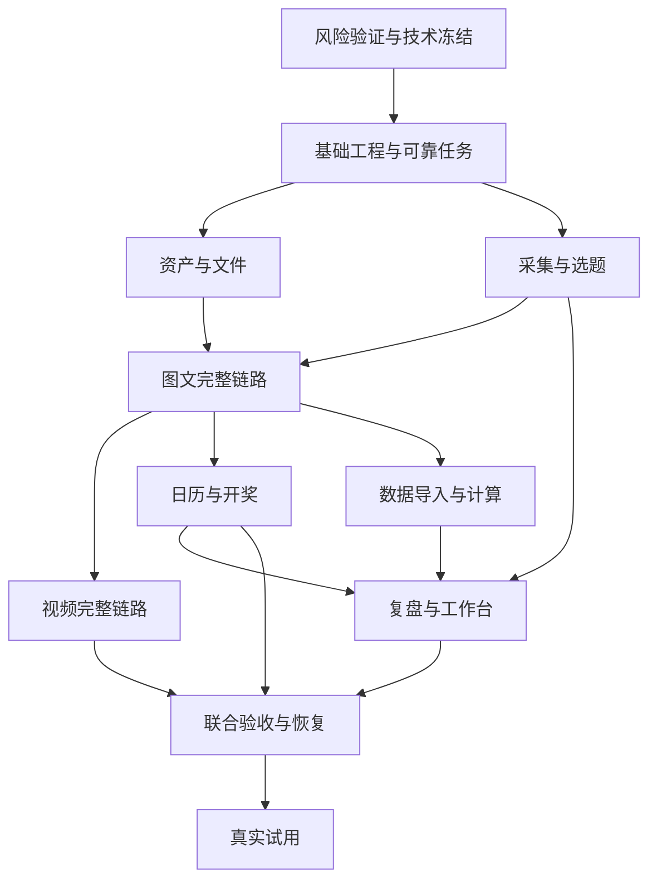

# YOYO 运营工作台开发实施计划 v1.0

编制日期：2026-10-06。依据：`docs/yoyo-workbench-v1.0/` 中的 01–14 文档、README 与参考资料索引。

执行进度入口：[开发进度与任务台账](tracking/开发进度.md)。本文件保留方案、依赖和估时，实际已完成/未完成状态只在任务台账维护；每轮交接追加到 [开发日志](tracking/开发日志.md)。

本文件是本轮新增的开发执行建议，不改写原设计基线，不表示技术接入、代码实现或软件验收已经完成。原文 C01“当前交付为文档”是此前交付背景；后续开发以用户最新请求为准。本轮交付详细计划，不启动业务实现或生产部署。

## 1. 当前状态与目标

- 2026-10-06初始盘点：项目目录只有设计文档、效果图和文档压缩包；未发现应用代码、依赖清单、数据库迁移或 Git 仓库。
- 从零建设内部运营系统，完整覆盖 R01–R15。单工作区、单小红书账号，保留 workspace_id/account_id 隔离设计。
- 完整闭环：真实自动采集 → AI 推荐 → 人采纳 → 图文/视频制作单 → 上传成品 → 内部审核 → 发布包 → 人工发布登记 → 数据确认 → 复盘和策略采纳。
- 并行业务闭环：活动规则和时间 → 可靠站内提醒 → 人工开奖登记 → 公布结果登记。
- P1/P2（自有后台自动同步、高级语义检索与视觉检查、多账号、自动发布及投放）不计入首版工期；不建设网页剪辑器、3D 编辑器或自动抽奖。

核心推进原则：尽早验证外部能力；先完成一条图文纵向链路；业务版本、幂等、权限、审计与持久任务先打底；视频、数据和提醒均按完整 P0 验收。

## 2. 建议技术方案及待冻结决策

以下保留初始候选方案；采用的技术基线见 [ADR-001](decisions/ADR-001-技术与运行环境.md)，2026-10-07用户确认的本地交付决策见 [ADR-003](decisions/ADR-003-本地一键启动与交付方式.md)。普通使用者默认完整 Docker Compose 启动，只需 Git、Docker 运行环境和少量配置；开发者保留原生入口。镜像封装应用、数据库、私有存储和媒体工具，发布提供预构建镜像；首次管理员设置、自动生成并持久化内部凭据、健康检查/迁移和数据保留纳入实施。不预装外部账号授权或开启无预算AI，来源接入与完整P0验收门禁保持。具体依赖版本、许可证、供应可用性及部署适配按阶段核验并锁定，不声明某个版本为最新或已验证。

| 层次 | 建议方案 | 目的与实施边界 |
|---|---|---|
| 工程 | TypeScript、pnpm workspace、单仓库 | 前后端共享契约；保留独立部署入口 |
| 前端 | React + Vite，查询缓存、表单校验、可访问组件 | 内部系统以客户端交互为主；按 7 张效果图建立组件和页面，不从图中复制业务数据 |
| API | NestJS 模块化单体 + REST /api/v1 | 按身份、资产、来源、内容、日历、指标划分模块；统一状态守卫 |
| 数据库 | PostgreSQL；Prisma 候选，复杂事务/索引用显式 SQL 迁移 | 关系、版本、逻辑唯一键和事务一致性集中管理 |
| 持久任务 | PostgreSQL Job/Outbox/租约；独立 worker 和 scheduler 进程 | 减少首版基础设施；提醒单独领取和处理，不能被转码或 AI 阻塞 |
| 文件 | S3 兼容私有对象存储 + 分片上传 + 签名访问 | 原件、代理、证据分开；开发存储模拟实现须验证生产兼容性 |
| 媒体 | 隔离的图片/PDF 解析与 FFmpeg/ffprobe 任务 | 原件不执行；限时限内存；工程文件采用用户提供的预览 |
| AI/OCR | 可替换提供方适配器 + JSON Schema + 版本和成本记录 | 不预设未经验证的供应商与模型；凭据仅在服务端 |
| 验证与部署 | 单元/数据库集成/API 契约/E2E 分层；容器部署 | CI 自动检查，测试环境验证迁移、任务、对象存储和恢复 |

建议目录：

```text
apps/web/                 页面、组件、交互
apps/api/                 会话、HTTP、权限与业务命令
apps/worker/              采集、AI、OCR、媒体、导出任务
apps/scheduler/           到期任务与提醒调度
packages/domain/          状态、守卫、业务服务
packages/contracts/       OpenAPI、运行时 Schema、生成的客户端类型
packages/db/              迁移、数据访问、事务
packages/integrations/    来源、模型、存储适配器
packages/ui/              公共界面组件
tests/                    集成、端到端、故障与评估用例
infra/                    环境、容器、部署和运维
docs/decisions/            技术决策
docs/evidence/             脱敏验证报告、索引和验收记录
```

生产证据文件本体放受限存储，仓库只保存脱敏报告和引用，不提交后台原图、凭据或个人资料。

阶段 0 冻结：登录供应方与登录/退出/过期协议；部署区域和域名；对象存储；来源提供方及授权范围；AI/OCR 与预算；文件上限；日志/备份保留；负责人与备用人。缺部署信息不阻断领域建模，但阻断生产上线。

## 3. 开工前补齐的契约细节

这些是实施细化，不应重新询问已经确认的产品范围。默认采用下列处理，发现影响业务范围的分歧再单独记录。

1. **身份与接口落地**：补实际会话协议；把 06 的组合路由展开为逐条 OpenAPI，PATCH 使用实体路径；错误、分页、权限、幂等与版本字段进入可校验 Schema。
2. **缺失关系字段**：核对 Topic.parent_topic_id、Campaign 的并发版本/提醒版本、MetricObservation 的统计类型、报告计算记录与 calculation_id、幂等结果表等，使 03/05/06/07/10 的引用均可落库。
3. **发布修订与账号约束**：同笔记仅一条 Publication；初始版本与 current_revision_id 分开；修订工作项再次审核后登记外部修改；跨账号引用在事务中拒绝。
4. **活动公开规则**：正文中的开奖/截止时间应由结构化字段辅助检查；已审核活动修改对外规则要生成内容修订并重新审核，同时记录外部同步待办。内部提醒偏移不属于发布载荷变更。
5. **视频时间轴**：首版主分镜采用连续时间段；配音/字幕/叠加说明作为独立属性，不用重叠主镜头表示多轨编辑；明确不适用的声音项可通过人工检查。
6. **资产与成品可预览条件**：原始工程允许预览不支持；提交审核的实际发布成品必须有可用预览。素材 retired 后拒绝新引用和新批准，历史引用保留。
7. **日历完整性**：同时实现月、周、列表视图；开奖时间唯一来自 Campaign；其他事件不能另写开奖副本。依赖例外需理由和审计。
8. **编辑与草稿**：保存生成可恢复快照，提交后冻结；审核中编辑必须先撤回；生成结果只写候选版本，应用前检查基础版本。
9. **辅助 AI 功能边界**：基础元数据和标签可人工维护；选择性提供 AI 标签建议与规则引用检查，不能扩大成 R17 高级语义检索或自动视觉合规。排期建议、反馈草案按 07 接入。
10. **接口遗漏核对**：预览文件授权访问、资产来源/衍生关系管理、报告人工确认、任务失败重试等若无明确端点，在所属阶段补齐契约与权限，不让前端直接修改数据库。

## 4. 分阶段工作包

阶段以 S0–S10 编号，与需求优先级 P0/P1/P2 区分。估时为有效开发人日，包含模块自测与正常集成；不包含等待授权、供应商采购和真实运营观察，也不代表 AI 自动执行所需时间。每阶段以演示和验收证据关闭，不以“页面写完”关闭。

### S0：风险验证与方案冻结（4–6 人日）

对应 D00、V01–V08。优先完成：

- 核对三类来源的真实能力：微博热点、小红书热点/话题信号、小红书优质笔记；每源形成提供方、实际类型、样本字段、配额、费用、授权边界和恢复方式报告。
- 多次实际读取验证稳定性；限流/会话失效/字段变化通过可控测试验证，不人为攻击生产来源。
- 验证 410 MB PDF、透明 PNG、PSD 配套预览、3D 工程及渲染、含音轨 MOV/长视频的存储和预览路径；探测默认 2 GB 上限是否足够。
- 检查账号、图文、视频后台脱敏样本的字段和时间口径；验证 AI/OCR 小样本输出、耗时和预算。
- 冻结候选技术方案，建立决策记录、需求—任务—测试映射和缺口清单。

交付：三份来源报告、媒体能力矩阵、数据字段映射、AI/OCR 试验记录、技术决策。真实输入缺失标记未验证，不用模拟样本关闭。

退出：已知每条外部依赖是否可用。来源未接通仍可推进其他开发，但完整首版发布门槛保持阻断。

### S1：基础工程与可靠任务底座（6–8 人日）

对应 D01、D11 基础；R01/R14。

- 初始化 Git、工作区结构、依赖锁定、开发说明、无密钥环境模板和 CI；建立完整 Compose/镜像骨架与开发原生入口，随模块逐步纳入服务。S1只验收当期基础系统，不承诺完整业务已可用。
- 建立依赖健康检查、受控迁移、内部凭据生成与持久化、首次管理员设置和普通重启数据保留；本地默认仅开放本机网页入口。
- 建立工作区、账号、用户/成员与组合角色；登录、退出、过期、CSRF、字段级修改权限和下载权限。
- 数据库迁移；统一错误、request_id、游标分页、UTC/IANA 时区、expected_version 与幂等请求存储。
- Job/Outbox：事务写事件、领取租约、心跳、重试、取消、超时、失败记录与管理员重试；任务结果应用前复查输入版本和取消标记。
- 独立提醒处理池，业务日志和审计；通知中心基础；模型/来源故障不影响人工操作。
- 前端导航和应用外壳，建立 1440/1280 布局、表单、表格、抽屉、空态、错误态、任务状态组件。

交付：可登录的空系统、真实权限验证、CI、可演示重启恢复的后台任务。

退出：跨空间访问/下载被拒绝；重复命令不重复创建；并发编辑返回 409；worker 崩溃后任务可恢复。

### S2：文件、IP 资产与品牌规范（6–8 人日）

对应 D02；R10/R11。

- 分片会话、断点续传、取消、重连查询、过期清理；实际大小/哈希/格式验证。
- 私有原件与受权预览；图像、PDF、视频代理、音频元数据处理；未知工程格式安全归档，允许配套预览。
- 资产分类、搜索、文件夹、标签、收藏、版本历史、使用范围确认、停用、来源/衍生关系和双向引用。
- 规范版本/规则/页码及启用记录；官方规范与运营提案分层。
- 资产选择器、原件下载与预览失败替代入口；成品归档复用内容/版本记录，不另复制文件体系。

交付：可用于实际设计协作的资产库。

退出：真实大文件续传成功且哈希一致；旧作品引用旧版本；越权被拒绝；源文件和代理互不覆盖。缺真实样本的格式不宣称已兼容。

### S3：真实采集、AI 选题与制作单（7–10 人日）

对应 D03/D04/D11；R03/R04/R05/R06 的生成部分。

- 按已验证提供方实现来源适配器和独立能力/健康状态，定时与手动刷新共用任务入口。
- 来源 ID/URL 去重、观察快照、主题聚类、证据引用、过期标记；同源单并发和失败暂停/恢复。
- 线索整理及结构化候选；服务端评分；无来源时明确常青原创，候选保存生成批次。
- 采纳/驳回和原因；采纳与内容创建同事务，失败重试沿用同一内容。
- 图文/视频制作单 Schema、提示词/模型/规范版本、ID 白名单、一次结构修复、预算闸门与成本记录。
- 至少 20 个固定评估样例先建立并持续扩展；包含伪造引用、恶意指令、缺数据和人工锁定字段。

交付：选题策划页面，真实来源→候选→内容草稿和制作单。

退出：来源失败独立可见；原始时间与采集时间区分；双击采纳只创建一次；错误引用不落库；生成不覆盖人工编辑。

### S4：图文制作、审核和发布归档（7–10 人日）

对应 D05 图文部分；R05/R07/R11。

- 列表过滤、逐页画面/文案、页排序、成品上传、素材选择、标题正文、快照和版本比较。
- 草稿→制作→审核→待发布的守卫；撤回、退回、批准；批准绑定不可变版本与载荷哈希。
- 内部辅助检查显示规则引用与待核对项，最终审核由有权限的人操作。
- 固定批准版本发布包：原始成品、顺序、文案和版本清单；打包异步且可重试。
- 发布暂存与正式登记分开；校验唯一平台笔记 ID、账号、时间和批准版本。
- 已发布修改、删除和重发分别留痕；修订工作项保留初始发布版本，更新实际确认版本。

交付：第一条完整图文生产链路，可进入受控内部演示。

退出：审核与编辑并发只有一个成功；批准后换图/改文需重审；导出内容与审核一致；缺笔记 ID 不计入已发布与统计。

### S5：完整视频协作（4–6 人日）

对应 D05 视频部分；R06/R07/R11。

- 分镜时间和目标时长校验、画面/字幕/口播/声音编辑、封面与成片播放器。
- 视频原件和播放代理分离；上传/转码/失败状态、格式说明、字幕及口播导出。
- 关联 3D 源工程、渲染图和视频片段，明确文件使用范围与声音检查。
- 复用版本、审核、导出与发布工作流；图文/视频类型转换创建转换版本并保留原稿。

交付：视频制作单→成片→内部审核→发布归档完整链路。

退出：缺最终视频不能提审；替换视频/封面/字幕/声音后重新审核；发布包不混用低清代理；真实视频样本可播放下载。

### S6：日历、活动与可靠提醒（6–9 人日）

对应 D06/D07；R08/R09/R14。

- 月/周/列表视图、类型/形式/负责人筛选；制作、审核、计划发布和数据回收节点。
- 拖拽变更预览、依赖冲突、例外理由和版本检查；AI 排期建议只在人工采纳后应用，跨节点原子校验。
- Campaign 规则、截止/开奖/发布顺序；draw 事件仅投影；暂停/恢复/取消/管理员纠错。
- 活动变更与 Outbox 同事务；提醒按活动版本去重；发送事务复查活动有效性，解决改期与领取/发送竞争。
- 到点/提前站内通知、个人已读、旧通知失效；停机恢复合并逾期通知，工作台逾期由业务状态计算。
- 人工开奖证据和公告证据分别记录；未确认发布的活动到期显示相应异常。

交付：可在浏览器关闭时持续运行的站内提醒；只承诺站内可见，不声称离站推送。

退出：重复执行无重复有效通知；改期旧任务无效；停机恢复只补一条；已读不清业务任务；开奖后未公告继续提示。

### S7：数据导入与可信指标（7–10 人日）

对应 D08/D09 计算部分；R12/R13。

- CSV/XLSX 模板、字段映射、手工输入、OCR 异步识别；原图区域与提取值并排核对。
- 账号/笔记匹配、窗口、快照时间、单位、流量类型、近似值和缺失原因；低置信与冲突明确标注。
- 部分确认：仅入账本次选中且合法的行；待确认数据不进正式统计。
- 指标逻辑键与有效唯一性；同键同值增加证据，同键不同值显式解决冲突。
- 撤销、证据共享及更正链；撤销早期批次不覆盖后续更正；报告失效与重算。
- 程序计算净增粉、关注效率、互动次数率、加权视频指标；保存输入观察 ID 与计算版本。

交付：可追溯的数据确认中心和指标 API。

退出：12 的全部指标金标准通过；重复导入不叠加；缺失不为零；累计不求和；窗口或流量口径不一致时提示不可比。

### S8：复盘、反馈与工作台收口（5–7 人日）

对应 D09/D10/D11；R02/R13/R15。

- 账号/内容看板及窗口、形式、流量、活动过滤；数据不足使用真实空态。
- AI 周报基于程序计算：事实/假设/行动/缺口分开；事实必须引用 calculation_id 和观察集合。
- 报告 partial/final/stale 和人工确认；采纳行动形成任务/策略提案，策略另行人工激活。
- 评论/来信手动录入、分类、回复草案、许可及撤回；不自动发送，未获许可不进入公开内容生成。
- 工作台汇总最多 3 个优先任务、待内部确认、数据缺口、采集异常、开奖/待公告；任务直达对象。
- 全局通知、设置、预算、运行状态、审计入口；基础标签建议按实际可读素材实现。

交付：六个主页面与全部辅助流程连通。

退出：无数据不生成趋势；数据撤销后报告 stale；策略未确认不生效；授权撤回材料不再进入对外生成。

### S9：全链路验收、部署与交接（8–12 人日）

对应 D12/D13；全部 R01–R15。

- 执行 T01–T24，并为每项记录构建版本、环境、时间、输入与证据位置。
- 演练 A 图文、B 视频及 3D 素材、C 压缩时间的活动提醒；真实来源接入与沙盒发布证据分别标明。
- 回归并发、权限、任务取消、过期结果、恶意外部文本/URL/文件、预算超限和来源故障。
- 1280/1440 桌面、键盘、长文本、空/错/加载状态、移动端轻操作检查。
- 约定规模压测：1 万资产、1 万线索、1 千内容、5 并发用户；记录网络和机器条件。
- 独立测试/生产数据库、对象存储与凭据；应用/worker/scheduler、HTTPS、备份、监控、告警负责人和备用人。
- 数据库与对象存储同恢复点演练；恢复后检查资产、发布、指标、更正链和提醒；应用回滚与兼容迁移演练。
- 输出管理员/运营操作说明、实际接口、环境配置、已知限制、来源与媒体报告、AI 评估和恢复报告。
- 按ADR-003提供固定版本的预构建linux/amd64、linux/arm64镜像，在干净环境完成clone→配置→启动→首次设置演练；记录最低资源和耗时，验证停止/重启/兼容升级的数据保留、备份恢复及可选外部能力提示。镜像仓库与发布权限另行落实。

退出：所有 P0 有通过证据；阻断和重要缺陷清零；三类来源真实验证、大文件兼容、AI 硬门槛、恢复演练均完成。

### S10：小范围试用（另计 1–2 个自然周）

对应 D14。每天记录实际制作流程问题；观察一周制作产能、数据完整率、提醒可靠性和来源稳定性；每周形成改进清单。修复工时从风险缓冲中消耗，范围新增单独估时。软件验收和真实涨粉效果分开。

## 5. 顺序与依赖



单开发者建议按 S0→S1→S2→S3→S4→S5→S6→S7→S8→S9 推进。S2/S3、S5/S6/S7 是团队可以并行的业务工作包，前提是共享契约已冻结；并行关系不表示本轮已委派任何开发。

里程碑：M0 外部风险已知；M1 基础系统与资产可用；M2 图文闭环可试用；M3 视频/日历/开奖完整；M4 数据/复盘/反馈完整；M5 全 P0 证据齐备可发布。三类来源尚未打通时，M2–M4 只能标记部分能力内部试用。

## 6. 估时、资源与排期方式

| 阶段 | 有效开发人日 |
|---|---:|
| S0 风险验证 | 4–6 |
| S1 基础工程 | 6–8 |
| S2 文件资产 | 6–8 |
| S3 采集与 AI | 7–10 |
| S4 图文闭环 | 7–10 |
| S5 视频闭环 | 4–6 |
| S6 日历开奖 | 6–9 |
| S7 数据指标 | 7–10 |
| S8 复盘收口 | 5–7 |
| S9 验收交接 | 8–12 |
| 合计 | **60–86** |

建议额外预留约 20% 缓冲，总规划容量约 **72–104 人日**。该估算是当前架构和完整 P0 范围下的工程判断，阶段 0 后应根据真实来源、媒体和 OCR 难度更新。

- 1 名熟练全栈开发、负责人及时提供样本与验收：约 15–21 个工作周，再观察 1–2 个自然周试用；不含外部等待。
- 2 名开发并有兼职设计/测试支持：按依赖并行规划约 9–13 个工作周，再试用；不能简单把人日除以人数视为承诺。
- AI 辅助可以缩短编码和文档整理，但来源授权、人工内容质量评审、故障恢复及真实试用需要实际验证，不能折算为即时完成。
- 建议按里程碑滚动安排具体日期，暂不承诺上线日。提供方费用、云资源和模型费用在 S0 获取真实报价后另列预算。

职责：开发负责实现、自动检查、部署及证据；产品/运营负责人负责来源权限、字段确认、开奖责任和业务验收；设计负责人负责真实资产、规范和内容质量确认；测试职责可以兼任，但测试结果必须可重现。

## 7. 首个开发迭代（前 10 个工作日的建议）

| 时间 | 主要工作 | 可检查结果 |
|---|---|---|
| 第 1–2 天 | 外部依赖与真实样本盘点，来源小实验，技术决策草案 | 可用/不可用/未验证清单、真实样本引用 |
| 第 3–4 天 | 大文件及 AI/OCR 试验，状态/模型/接口细节收口 | 来源报告初版、媒体矩阵、契约和迁移方案 |
| 第 5–7 天 | 工程、登录、角色、账号、数据库与 UI 外壳 | 能登录、能区分角色、CI 可运行 |
| 第 8–10 天 | 幂等、版本、Job/Outbox、通知基础和权限测试 | 可演示重复请求、并发冲突、worker 重启恢复 |

该安排对应 S0/S1 的较顺利情形；若前期验证达到估算上限，基础任务底座顺延，不省略验证。外部访问暂缺时先推进契约/基础工程，把未验证项保留到对应关口。

## 8. 所需输入与最晚交付节点

| 输入 | 最晚需要时点 | 缺失影响 |
|---|---|---|
| 三类来源的授权访问条件或可评估提供方 | S0 验证；S3 真实接入 | 不阻断基础代码，阻断完整 R03 和最终首版 |
| 账号/图文/视频后台脱敏样本各一份 | S0 评估，S7 前确认 | 模板可做，真实 OCR 与字段验收不能完成 |
| 官方完整手册、矢量/logo、真实媒体样本 | S0/S2 | 规范最终确认、真实格式兼容和正式 UI 素材不能关闭 |
| 登录方式、部署地、域名、预算负责人 | S1 前冻结登录，S9 前齐备 | 生产部署和实际登录集成受阻 |
| AI/OCR 可用服务与成本上限 | S3 前 | 可用模拟适配器开发，不能启用无预算生产任务 |
| 开奖主/备负责人和站内提醒接受范围 | S6 前 | 无法完成活动责任与触达验收；离站渠道另计范围 |
| 字体、音频、第三方素材使用依据 | 相关素材批准前 | 仅阻断受影响素材使用 |

这些输入按阶段收集，无需在计划阶段一次补齐；敏感信息经部署密钥管理或团队约定渠道交付。

## 9. 验收与进度管理

每个工作项固定记录：需求 ID、依赖、实现范围、API/数据影响、负责人、估时、状态、测试及证据。建议状态为待开始/开发中/待验证/被依赖阻塞/已验收；功能已编码但未验证不记“完成”。

需求覆盖：R01→S1；R02→S8；R03/R04→S3；R05→S3/S4；R06→S3/S5；R07→S4/S5；R08/R09→S6；R10/R11→S2/S4/S5；R12→S7；R13→S7/S8；R14→S1/S6/S8/S9；R15→S8。

模块完成门槛：核心流程可演示、关键异常可恢复、真实权限生效、状态与契约一致、必要测试通过、证据和限制已记录。测试优先放在状态事务、去重撤销、提醒竞争和真实媒体集成，不为静态装饰组件堆叠低价值测试。

最终质量目标沿用 04 的建议值并在 S0 冻结：列表/详情接口 p95≤1 秒，主要界面可操作≤3 秒，异步受理≤2 秒，正常提醒站内可见延迟 p95≤60 秒；RPO≤24 小时、RTO≤4 小时均须演练。报告必须带规模、机器、网络及样本条件。

任何范围变化记录需求、状态、接口、数据迁移、测试与工时影响；来源不可用不能通过更改页面文案或测试口径消除缺口。阶段交付可以提前试用，完整首版必须满足 R01–R15 与 T01–T24 的证据要求。
