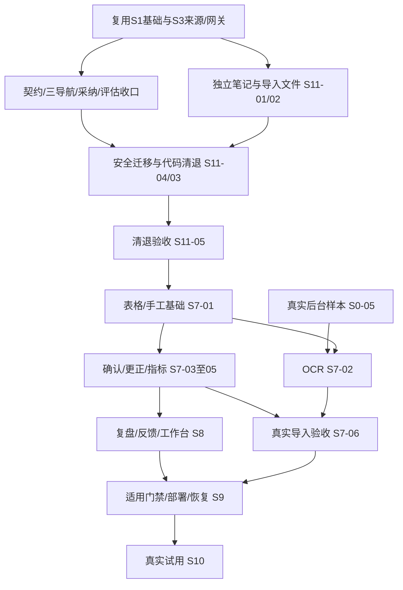

# YOYO运营工作台开发实施计划 v1.2

更新2026-10-09；文件路径沿用v1.0。依据[CHANGE-008 / ADR-008](decisions/ADR-008-删除排期日历与活动.md)及新版01–14。实际状态只维护在[开发进度](tracking/开发进度.md)，交接见[开发日志](tracking/开发日志.md)。本文为方案/依赖/估时，不表示清退或新功能已实现。

## 1. 新目标与范围

三主页面：工作台、选题策划、数据复盘。核心闭环：真实来源 → AI选题 → 采纳决策 → 系统外制作/人工发布 → 独立笔记登记 → 数据确认 → 计算/复盘与策略采纳。排期日历、活动、AI排期、开奖/公告/提醒、活动标记和自动回收节点全部取消；来源调度和系统通知保留。

R05/R06/R07/R08/R09/R10/R11/R17全部取消，含品牌规范、内容版本/审核、发布包及归档，取消而非延期。适用P0为R01–R04/R12–R15。保留图文/视频统计维度及后台样本；不开发成片处理。P1/P2自动后台同步、自动发布、多账号/投放另计。

## 2. 技术路线与清退

复用当前React/Vite、NestJS REST、PostgreSQL SQL迁移、Job/Outbox、采集Bridge/适配器、AI网关、私有存储、通知审计和Compose/原生入口；不增加依赖/抽象，不重新搭工程。静态清退范围和风险见ADR-007及ADR-008。S6六项尚未实现业务页面/API/表，现有占位/提醒底座/活动字段需收口；定向清退比重建简便。

关键接口：采纳不建Content/制作Job；AI不查rule_sets/assets；Publication不依赖内容批准版本；退出Calendar/Campaign/排期接口、is_campaign及campaign_evidence；文件仅导入和证据purpose，不复用asset.edit权限。

保留001–024迁移并新增兼容迁移，不删除旧SQL/db push/级联删表。先停旧生产及日历/活动/回收写入、取消对应旧任务并阻止提交、迁出保留笔记ID和关系，再移除专属代码/config。当前空开发使用库不是所有实例为空的证明；物理对象清理另经引用报告和恢复验证。旧迁移/测试/证据不是新适用门禁的通过证据。

## 3. 工作包与具体顺序

原S编号全部保留，已取消任务在台账标CANCELLED，原完成证据保留。S11为新增清退阶段，编号不代表必须最后执行；它是S7的前置；S6不再实施。

| 顺序/工作包 | 范围与退出判据 |
|---|---|
| A 契约与保留接口收口 | S0-08/S1-07/S3-05/S3-07：三导航、旧角色兼容、采纳决策、新AI输入/输出与评估、生成器/契约/调用同步；不接受旧content_id响应 |
| B 独立业务基础 | S11-01：Publication最小模型/API及兼容迁移，保留原ID和账号/实际时间，去审核继承链，登记幂等、移除活动标记且不创建回收事件；S11-02：导入/证据文件白名单、权限及安全解析、私有存储恢复 |
| C 代码与数据清退 | S11-04：旧Job/Outbox/通知/缓存/幂等/角色迁移、保留数据引用及备份；S11-03：删除专属页面/生产API/领域函数、处理器和无用依赖/工具/配置；退出提醒池/诊断/config，来源scheduler及共享基础保留 |
| D 清退验收 | S11-05：T25/T26及受影响回归，空库/旧库副本升级、旧接口/深链退出、零资产推荐、旧任务竞争、浏览器三导航；留下迁移与清理证据 |
| E 数据 S7＋S0-05 | CSV/XLSX/手工批次、独立笔记匹配、部分确认/去重/撤销/更正、计算金标准；真实后台OCR和字段证据另收口 |
| F 复盘与工作台 S8 | 笔记分析、AI事实引用/partial/stale、策略人工激活、反馈许可、三页面待办、设置运行与新范围AI回归 |
| G 交付验收 S9 | 新A/B/C演练、17项适用门禁、权限/性能/备份恢复、多架构Compose与干净环境交接 |
| H 试用 S10 | 1–2自然周实际来源/选题采纳/反馈/数据记录，问题独立BUG编号与修复验证 |

S7-03以S7-01及S1-04为前置，不再硬依赖OCR；无后台样本时先做表格/手工确认、更正和指标。S7-06最终验收仍依赖S7-02真实OCR，不能规避未验证项。S8/S9移除S6前置；数据导入/反馈不用等待S4登记。外部失败不阻断无依赖工作。

## 4. 阶段依赖

此图为工作包关系，准确叶子依赖以台账为准。单人按A→B→C→D后推进S7；依赖满足时可交错实施，并非本轮已委派并行开发。

里程碑：M1取消功能实际退出且保留来源/选题可用；M2独立笔记登记/数据导入可试用；M3指标/复盘/反馈完整；M4全部适用门禁及恢复交接可发布。制作/素材不再是里程碑。

## 5. 剩余工程估时

以下以a290414现有代码定向删减为基础，含模块自测与正常联调，不是重新从零估算或AI执行时长。

| 工作包 | 有效人日 |
|---|---:|
| A–D 契约/重验/独立笔记/文件/兼容清退 S11 | 4–7 |
| S7 数据/OCR/指标（含S0-05真实字段验证） | 7–10 |
| S8 复盘/反馈/工作台 | 5–7 |
| S9 当前范围验收/部署/恢复 | 6–9 |
| 合计剩余 | **22–33** |

建议加20%风险缓冲，规划约27–40人日；单名熟练全栈约6–8工作周，另1–2自然周试用，不含后台样本/部署输入等待。清退4–7人日受实际旧数据/任务/文件引用影响，盘点后滚动复估，不承诺删除只需几个命令。

旧60–86人日是全产品从零规划；已投入任务数量和旧验收数量不能换算成耗时，也不能从旧估时机械扣除得到新工期。推倒重来需重做已有安全/来源/网关/运行能力并仍需数据迁移，现无证据支持它更省事。

## 6. 输入、检查与交付

仍需三类来源访问维护、账号/外部图文/视频后台样本、AI/OCR配置、部署与运行预算/域名、实际流量/归因字段。责任沿用各本地使用者。取消手册/素材/工程/成片/音频和开奖/提醒输入及白名单审批，不恢复旧格式扩展。

代码变动按风险执行构建/类型、契约生成校验、权限/事务/任务/迁移集成和浏览器核心流程；纯文档只检查链接、编号、状态统计与依赖。测试使用独立库，真实采集/模型调用和合成测试分开留证，无真实平台自动发布。

适用发布门禁：R01–R04/R12–R15，T01–T05/T15–T26共17项PASS、重要缺陷清零、真实来源/后台/AI与恢复证据齐备。T06–T14取消不标PASS；T25清退是硬门禁，不能只藏菜单就发布。目标规模、p95、文件限额、RPO/RTO见04并实测。

本轮不做业务删码/有损清理/部署；后续开工先将S0-08设DOING，冻结新采纳/笔记/文件/无日历活动契约，再按B/C实施。每个任务实际负责人、日期、目录/分支/提交、证据和下一步只在任务台账登记。
